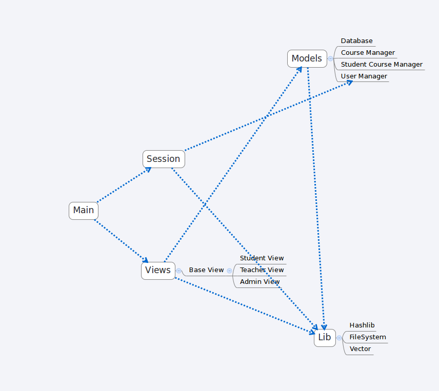

# OOP Doc

## Group

- 曾昱深 3120100260 生物系统工程

- 孙士权 3120103709 计算机科学与技术

## 概要设计

我们使用 Git 作为我们的版本控制工具，
使用 Github 作为我们代码托管平台及 Issues 管理（https://github.com/zenozeng/jw） 。

我们原定使用 MVC 架构设计，但 Controller 部分被弱化，改为 Model-View 架构。



### Features

- 基于命令行的交互式界面（CUI）

- 与文件系统高度一致的数据库设计

- 基本的 CRUD

## 系统用户手册

### Build & Run

#### Linux

```
make build
```

#### Windows

```
make winbuild
```

### Usage

#### Admin

```
Type following commands for further step:
	Common Commands:
		exit: logout
		help: get help
	Course Manager:
		courses: list all courses
		course: show detail of course
		edit course: edit course
		add course: add course
		remove course: remove course
	User Manager:
		users: list all users
		edit user: edit user
		add user: add user
		remove user: remove user
	Student Course Manager:
		courses of student: list all courses of a student
		add course for student: add course for student
		remove course of student: remove course of student
		get course score of student: get course score of student
		set course score of student: set course score of student
```

#### Teacher

```
Type following commands for further step:
	help: get help
	courses: display all courses under your taught
	my courses: display all courses under your teaching
	my course: display the detail of the course usder your teaching
	score: give score to your student
	exit: logout and exit
```

#### Student

```
Type following commands for further step:
	help: get help
	courses: display courses for this term
	course: display detail of the course
	select: select courses
	exit: logout and exit
```

## 系统操作截图

TODO
